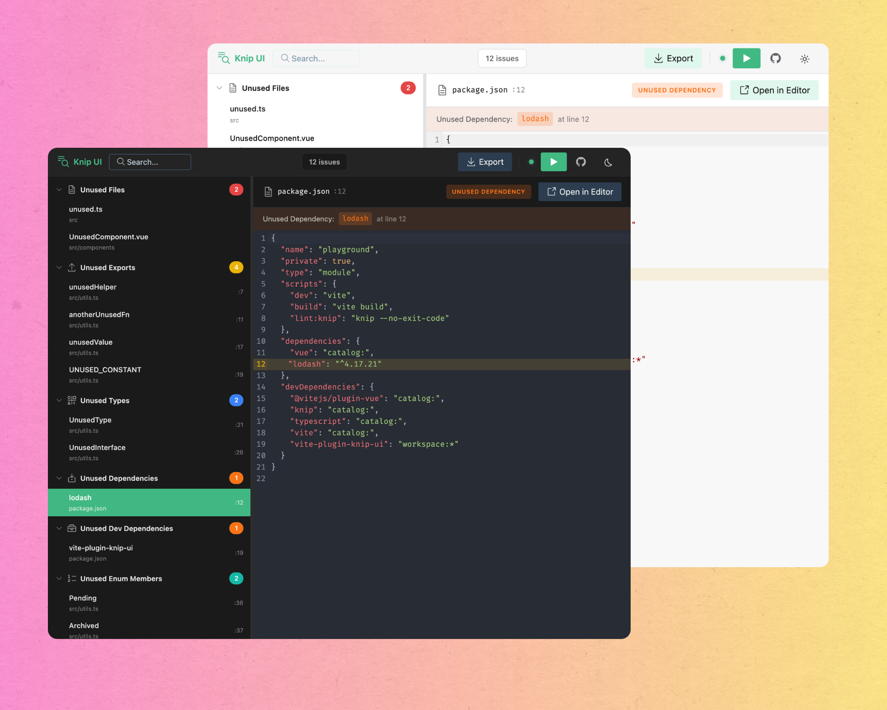

# vite-plugin-knip-ui

[](https://www.npmjs.com/package/vite-plugin-knip-ui)
[](https://github.com/kuttyhub/vite-plugin-knip-ui/actions/workflows/ci.yml)
[](https://opensource.org/licenses/MIT)

Visualize [Knip](https://knip.dev) dead code analysis results in your Vite dev server. check out the [docs](https://knip-ui.netlify.app) for more information



## Features

- **Run Knip analysis** directly from the browser with one click
- **Tree-structured sidebar** to view issues grouped by category
- **All issue types** - files, exports, dependencies, binaries, and more
- **Click to open** any file in your editor instantly
- **Export reports** as JSON or CSV
- **Real-time status** with WebSocket connection indicator

## Installation

```bash
pnpm add -D vite-plugin-knip-ui
```

## Usage

Add the plugin to your `vite.config.ts`:

```ts
import { defineConfig } from 'vite'
import knipUi from 'vite-plugin-knip-ui'

export default defineConfig({
  plugins: [knipUi()],
})
```

Start your dev server and navigate to `/__knip-ui` to view the analysis panel.

## Options

```ts
knipUi({
  base: '/__knip-ui', // Custom base path for the UI
})
```

## Requirements

- Vite 5.x, 6.x, or 7.x
- Knip installed in your project

## CI/CD Integration

Run Knip in your CI pipeline to prevent dead code from reaching production:

```yaml
- name: Check for dead code (Knip)
  run: pnpm lint:knip
```

Available scripts:

- `pnpm lint:knip` - Fails if any dead code is found (strict)
- `pnpm lint:knip:ci` - Reports issues without failing (gradual)

See the [CI/CD Integration Guide](https://kuttyhub.github.io/vite-plugin-knip-ui/guide/ci-cd) for detailed setup instructions.

## Development

```bash
# Install dependencies
pnpm install

# Build the plugin
pnpm build

# Run the playground
cd playground && pnpm dev
```

## Credits

This project is built with:

- [Knip](https://knip.dev) - Dead code analysis for TypeScript/JavaScript
- [birpc](https://github.com/antfu/birpc) - Extracting RPC utilities by [@antfu](https://github.com/antfu)
- [Vite](https://vitejs.dev) - Next generation frontend tooling
- [Vue DevTools UI](https://github.com/vuejs/devtools) - UI components

## Contributing

See [CONTRIBUTING.md](CONTRIBUTING.md) for development guidelines.

## License

[MIT](LICENSE) © [Nishanth S](https://github.com/kuttyhub)
